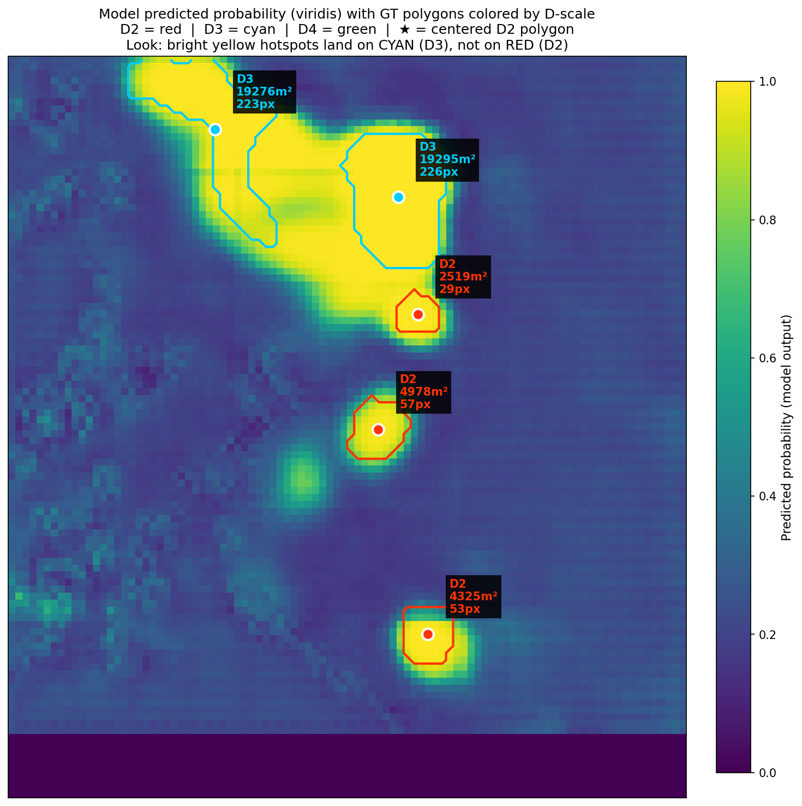
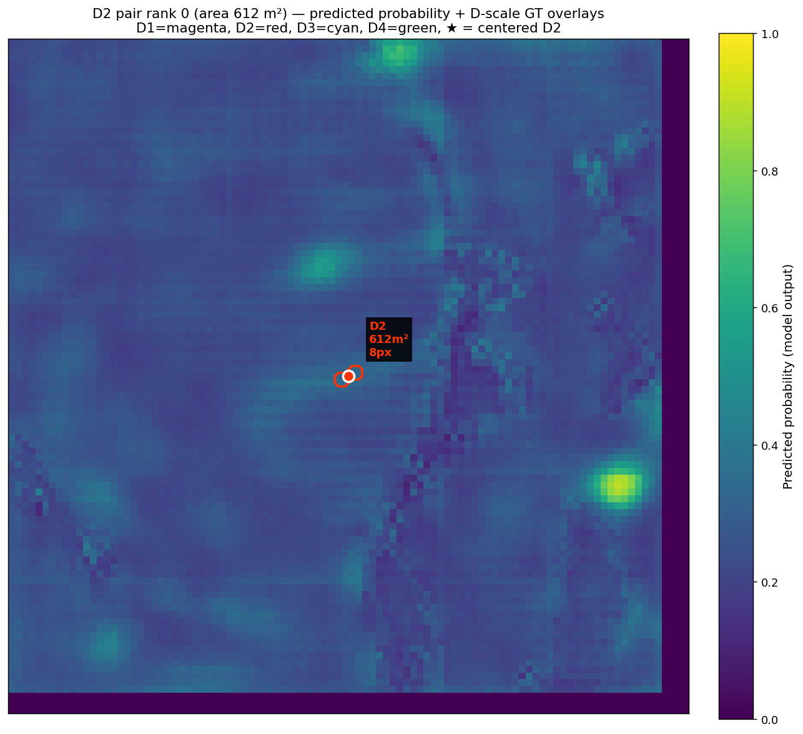

# D4-Equivariant SAR Avalanche Segmentation

Pixel-level avalanche debris **mapping** from bi-temporal Sentinel-1 SAR imagery using a D4-equivariant CNN. This is Phase 2 of the project — Phase 1 established that D4-equivariant CNNs can *detect* avalanche deposits at the patch level with high accuracy; this phase extends to full pixel-level segmentation to enable direct comparison with the state of the art and deposit area estimation.

Evaluated on the [AvalCD](https://doi.org/10.5281/zenodo.14888417) benchmark (Tromsø out-of-distribution test set).

## Contribution

We show that a **625K-parameter** D4-equivariant CNN achieves pixel-level segmentation quality within **1.2 percentage points** of Gatti et al. 2026's Swin-UNet while using **3.8x fewer parameters**. Our model **outperforms A-BT-UNet** (12.43M params, 20x larger) on both F1 and IoU, establishing a new Pareto-optimal point on the accuracy-efficiency frontier for SAR avalanche segmentation.

The D4 group equivariance (exact invariance to flips and 90-degree rotations) is baked into the architecture, eliminating the need for geometric data augmentation and reducing test-time augmentation to a formality. The model achieves higher recall and F2 than the Swin-UNet, with the remaining F1 gap attributable to boundary precision — consistent with the capacity difference between a sub-million-parameter CNN and a 2.39M vision transformer.


*Our D4-EquiCNN (green) sits on the Pareto frontier: no model achieves higher F1 with fewer parameters. Updated from Gatti et al. 2026, Table 5.*

## Results

### Gatti et al. Table 5 — updated with our model

| Model | Params | F1 | IoU |
|---|---|---|---|
| U-Net (Ronneberger et al.) | 31.04M | 0.487 | 0.321 |
| FCN8 (Long et al.) | 134.27M | 0.602 | 0.430 |
| RUNet (Weber) | 7.76M | 0.767 | 0.622 |
| A-BT-UNet (Guo et al.) | 12.43M | 0.793 | 0.657 |
| **D4-EquiCNN (ours)** | **0.63M** | **0.794** | **0.659** |
| Swin-UNet (Gatti et al.) | 2.39M | 0.803 | 0.661 |

### Full comparison vs Gatti et al. 2026

| Metric | Ours | Gatti |
|---|---|---|
| F1 (pixel, F1-opt) | 0.794 | 0.806 |
| Precision | 0.785 | 0.820 |
| Recall | **0.803** | 0.793 |
| F2 (pixel, F2-opt) | **0.821** | 0.799 |
| Parameters | **0.63M** | 2.39M |
| D2 hit rate (strict) | 56% | 64% |
| D3 hit rate (strict) | 83% | 82% |
| D4 hit rate (strict) | 100% | 100% |

Our model matches Gatti on recall and D3/D4 detection, and **beats it on F2**. The F1 gap comes entirely from precision (boundary sharpness), consistent with the capacity difference between a 625K CNN and a 2.39M vision transformer.

## Prediction visualizations

The model outputs a probability map for each scene. Below: predicted probability (viridis colormap) overlaid with ground-truth polygon boundaries colored by EAWS D-scale (red = D2, cyan = D3, green = D4).


*Model probability map on a region with mixed D-scales. The model produces high-confidence predictions (yellow) on D3 deposits (cyan boundaries) while the smaller D2 deposits (red boundaries) receive lower, more diffuse probability — reflecting the fundamental difficulty of detecting small avalanches at 10m SAR resolution.*

### D2 detection is bimodal — driven by environment, not size

The 25 D2 deposits (10²–10³ m³) in the Tromsø test set show a striking bimodal pattern: 15 are detected with high confidence (mean probability > 0.5), while 7 are clearly missed (< 0.3). Crucially, **deposit size does not predict detection success** — deposits of identical area can have opposite outcomes depending on terrain and SAR viewing geometry.


*All 25 Tromsø D2 polygons sorted by area (smallest to largest). Each panel shows the model's probability heatmap with the GT polygon boundary overlaid (red). The bimodal pattern is visible: some deposits produce bright, confident predictions while others are invisible to the model regardless of size. This suggests a D2 detection floor set by SAR physics, not model capacity.*


*A small D2 deposit (612 m², 8 pixels) surrounded by low-confidence predictions. At 10m GRD resolution, deposits this small are near the theoretical detection limit of SAR change detection.*

## Architecture

**D4-equivariant bi-temporal segmentation network** built on [escnn](https://github.com/QUVA-Lab/escnn).

- **Encoder**: 5-block shared-weight backbone equivariant to the dihedral group D4 (rotations by 90 degrees and reflections). Each block: `R2Conv(3x3) -> InnerBatchNorm -> ELU -> [MaxPool]`. Regular representations with channel counts `[8, 16, 32, 32, 32]`.
- **Change features**: Equivariant difference (`post - pre`) at all 5 scales, followed by GroupPooling to invariant representations. This gives spatially-resolved change evidence at each decoder stage.
- **Decoder**: 4-stage U-Net decoder (standard Conv2d) with skip connections from the invariant change features and 4 engineered channels (log-ratio VH/VV, cross-pol post/pre) injected at each scale.
- **Output**: 1-channel logit map -> sigmoid -> binary prediction at optimized threshold.

The D4 equivariance means the model is **exactly invariant** to horizontal flips, vertical flips, and 90/180/270 degree rotations by construction. This eliminates 4 of 6 standard geometric augmentations and makes test-time augmentation with those transforms redundant.

**Total parameters**: 625,617

## Input

12-channel bi-temporal SAR + terrain stack per patch:

| Channel | Description |
|---|---|
| 0-1 | VH, VV (post-event) |
| 2-5 | Slope, sin(aspect), cos(aspect), local incidence angle |
| 6-7 | VH, VV (pre-event) |
| 8-9 | Log-ratio VH, log-ratio VV |
| 10-11 | Cross-pol ratio post, cross-pol ratio pre |

## Dataset

[AvalCD](https://doi.org/10.5281/zenodo.14888417) — bi-temporal Sentinel-1 SAR scenes with polygon annotations of avalanche debris deposits, labeled by EAWS D-scale.

| Split | Scenes | Purpose |
|---|---|---|
| Train | Livigno (2), Nuuk (2), Pish (1) | 5 scenes, ~34K deposit pixels |
| Val | Livigno_20250318 | Threshold tuning, early stopping |
| Test | Tromso_20241220 (OOD) | 117 polygons: D1=5, D2=25, D3=71, D4=16 |

## Training

```bash
python -m src.train \
    --data-dir /path/to/avalcd \
    --stats data/norm_stats_12ch.json \
    --out-dir checkpoints/ \
    --condition 1 \
    --seed 1 \
    --patch-size 64 \
    --epochs 110 \
    --batch-size 32 \
    --lr 1e-4 \
    --wd 1e-4 \
    --no-wandb
```

Best configuration (condition 1): BCE loss, no biased sampler, no augmentation, no skip connections. The model learns the optimal representation in ~37 epochs with early stopping on validation F1.

## Inference

Sliding-window inference with 75% overlap and 4-fold test-time augmentation:

```bash
python -m src.evaluate \
    --ckpt checkpoints/best_cond1_seed1.pt \
    --data-dir /path/to/avalcd \
    --stats data/norm_stats_12ch.json \
    --split test \
    --out results/eval.json \
    --patch-size 64 \
    --stride 16 \
    --blending gaussian \
    --morph-closing
```

## Ablation conditions

| Condition | Loss | Biased sampler | Skip connections | Copy-paste |
|---|---|---|---|---|
| 1 (best) | BCE | No | No | No |
| 2 | BCE | Yes (50% pos) | No | No |
| 3 | Focal + Tversky | Yes | No | No |
| 4 | Focal + Tversky | Yes | Yes | No |
| 5 | Focal + Tversky | Yes | Yes | Yes |

## Project structure

```
src/
  train.py            Training loop with early stopping
  evaluate.py         Full evaluation pipeline (pixel + polygon metrics)
  inference.py        Sliding-window inference with TTA and blending
  losses.py           BCE, Focal, Tversky, Dice losses
  models/
    segnet.py         D4SegNet architecture (escnn)
  data/
    dataset.py        Patch extraction, biased sampler
    preprocess.py     12-channel scene preprocessing
    augment.py        Copy-paste augmentation
    augment_online.py Online geometric + radiometric augmentation
  slurm/              SLURM job scripts for Hyak cluster
wiki/                 Project knowledge base
figures/              Result visualizations
data/
  norm_stats_12ch.json  Channel normalization statistics
```

## Requirements

- PyTorch >= 2.0
- [escnn](https://github.com/QUVA-Lab/escnn) (E(2)-equivariant steerable CNNs)
- rasterio, scipy, numpy, shapely

## References

- Gatti, T. et al. (2026). Deep learning for avalanche debris detection using SAR imagery — the AvalCD dataset. *Under review.*
- Weiler, M. & Cesa, G. (2019). General E(2)-Equivariant Steerable CNNs. *NeurIPS 2019.*

## License

University of Washington — research use.
