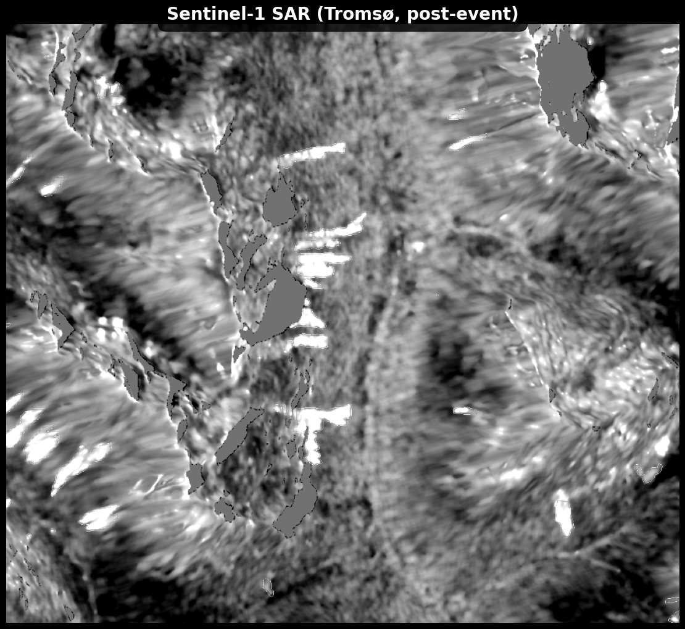
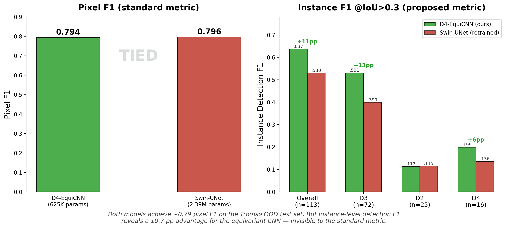
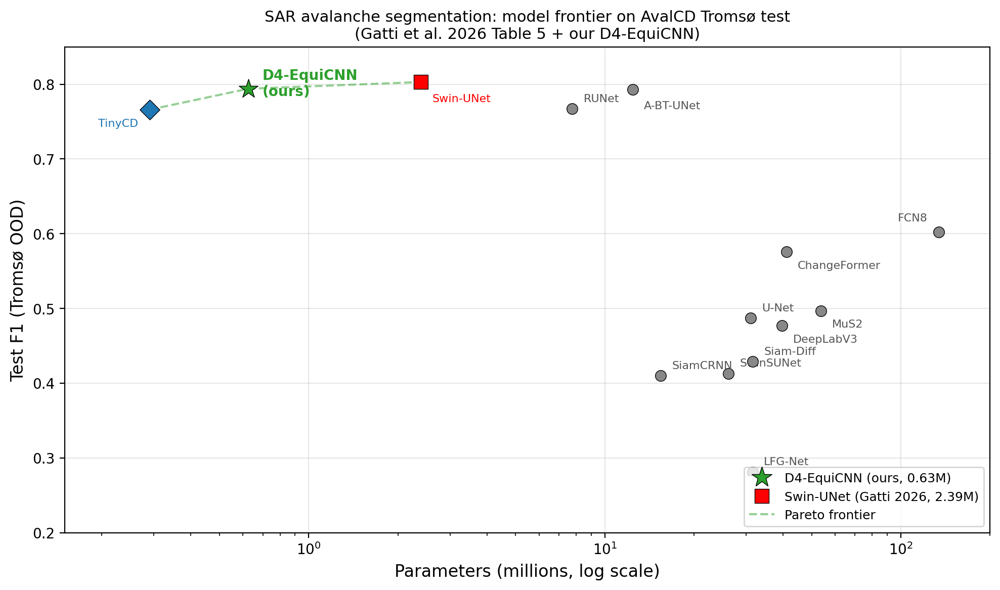
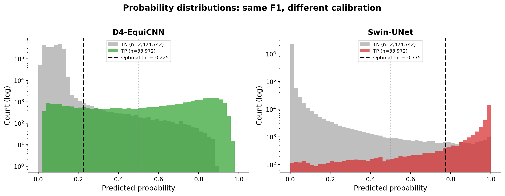
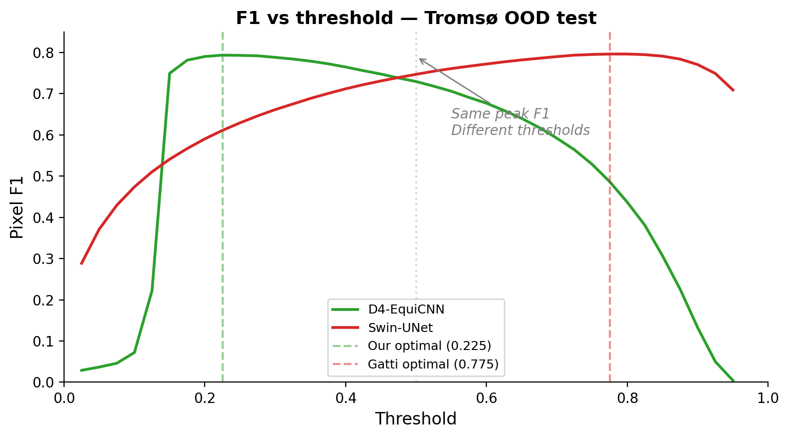
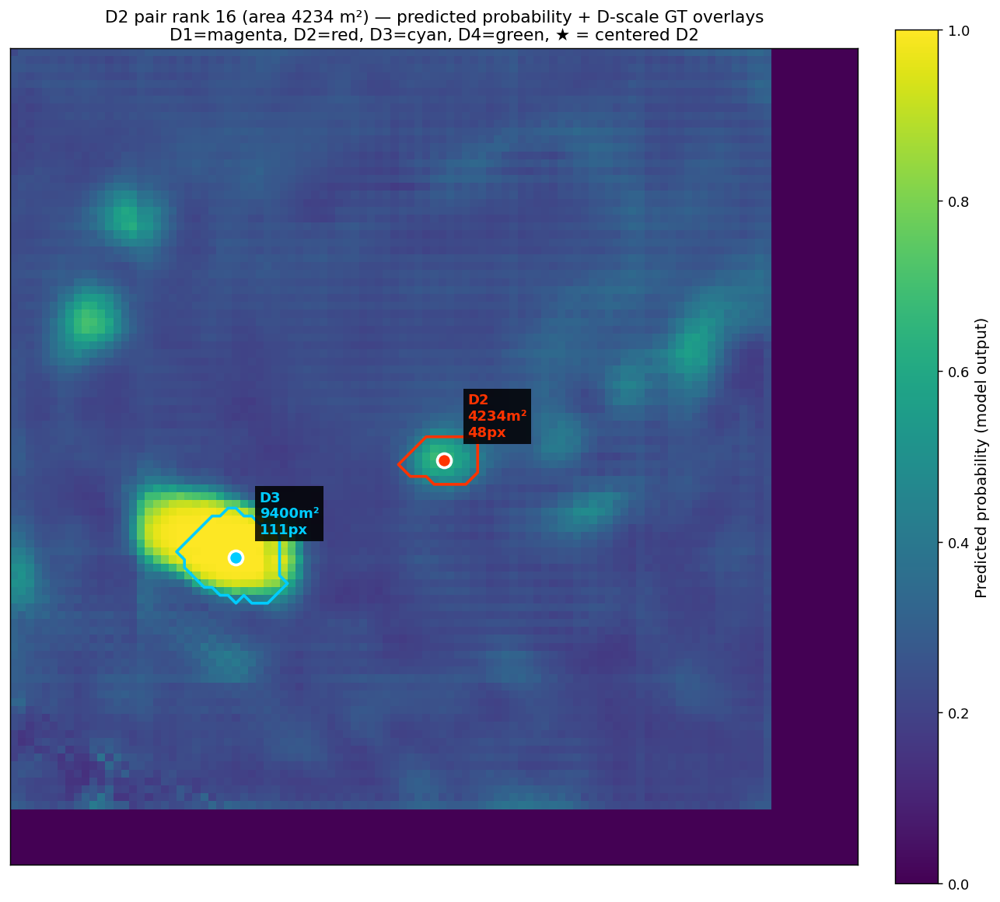
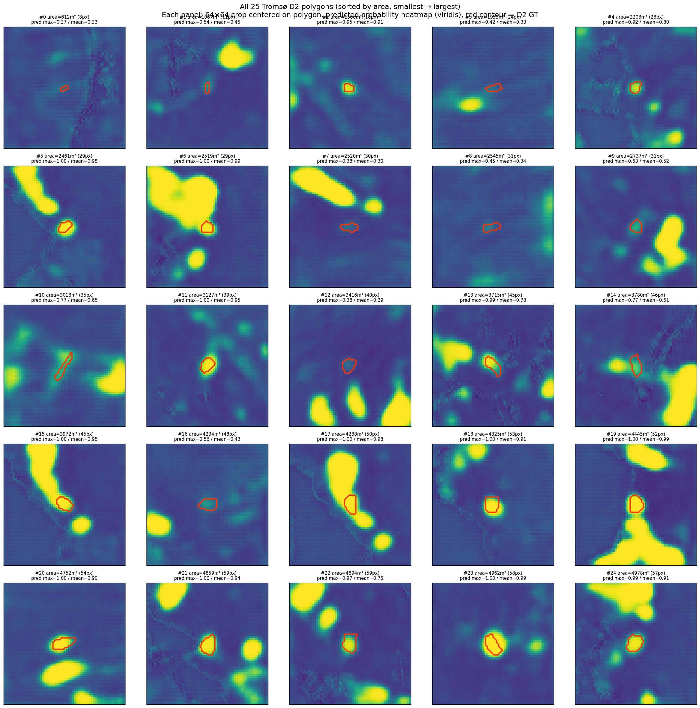
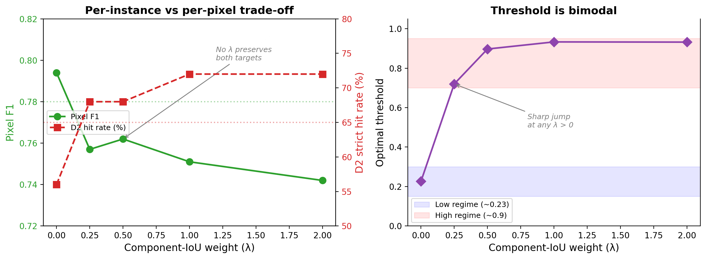
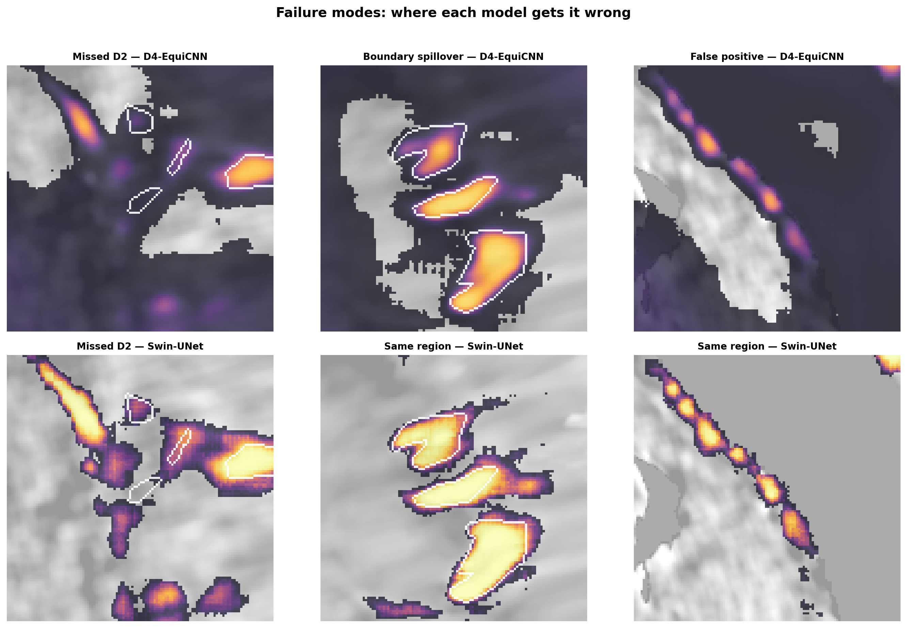

# D4-Equivariant SAR Avalanche Segmentation


*Same pixel F1. Different avalanche detection. Our 625K-parameter equivariant CNN finds more individual deposits than a 2.39M-parameter Swin-UNet — a difference invisible to the standard metric.*

## Overview

This project builds a pixel-level avalanche debris segmentation model from bi-temporal Sentinel-1 SAR imagery using a D4-equivariant CNN. It is **Phase 2** of a two-phase project:

- **[Phase 1](https://github.com/sanmarcog/Equivariant-CNN-SAR)** — patch-level binary detection ("does this 64×64 patch contain avalanche debris?"). Established that D4-equivariant CNNs match or exceed standard CNNs and vision transformers on SAR change detection at matched parameter count.
- **Phase 2 (this repo)** — pixel-level segmentation ("which pixels are avalanche debris?"). Extends the same equivariant architecture to dense prediction and introduces instance-level detection F1 as an alternative evaluation metric.

The model is evaluated on the [AvalCD](https://doi.org/10.5281/zenodo.14888417) benchmark ([Gatti et al. 2026](https://github.com/mattiagatti/avalanche-deep-change-detection)), which provides bi-temporal SAR scenes with polygon annotations of avalanche debris deposits labeled by EAWS D-scale. The Tromso scene serves as the out-of-distribution test set.

**Why we retrained Gatti's model.** Gatti et al. report pixel F1 = 0.806 for their Swin-UNet but did not release model weights or evaluate instance-level metrics. To produce a fair instance-level comparison — same evaluation code, same test scene, same metrics — we retrained their Swin-UNet (2.39M params, unimodal SAR-only) from their published hyperparameters and [code](https://github.com/mattiagatti/avalanche-deep-change-detection). The retrained model achieves pixel F1 = 0.795 on Tromso, within 1.1 pp of their reported number. All instance-level metrics in this README come from this retrained model, clearly labeled. Gatti's published pixel-level numbers are preserved as-is wherever they appear.

## The problem with pixel F1

Pixel F1 treats every pixel independently. Two models with the same pixel F1 are considered equivalent. But when we evaluate on **instance-level detection** — "which avalanches did the model find?" — the ranking changes.



Our D4-equivariant CNN and Gatti et al.'s Swin-UNet achieve nearly identical pixel F1 (0.794 vs 0.795) on the Tromso OOD test set. But on instance-level detection F1 at IoU > 0.3, our model leads by **10.7 percentage points** overall and **13 pp on D3 avalanches** (the operationally most relevant scale, n=72). This gap is robust across IoU thresholds (0.1–0.5) and under center-point matching as an alternative to IoU matching.

Pixel F1 isn't enough on its own for this problem. The operational question is "which avalanches were found," not "which pixels were correctly labeled."

## Results

### Pixel-level comparison

Gatti's numbers are from their published paper. For the instance-level comparison below, we retrained their Swin-UNet from their published hyperparameters (weights not released); the retrain achieves pixel F1 = 0.795 on Tromso, within 1.1 pp of their reported 0.806. Both Gatti columns are shown for transparency.

| Metric | D4-EquiCNN (ours) | Swin-UNet (Gatti, published) | Swin-UNet (our retrain) |
|---|---|---|---|
| F1 (pixel, F1-opt) | 0.794 | 0.806 | 0.795 |
| Precision | 0.785 | 0.820 | 0.786 |
| Recall | **0.803** | 0.793 | 0.806 |
| F2 (pixel, F2-opt) | **0.821** | 0.799 | 0.834 |
| Parameters | **0.63M** | 2.39M | 2.39M |

Our model has higher recall and F2 than the Swin-UNet. The F1 gap vs Gatti's published number (0.806) comes from precision (boundary sharpness), consistent with the capacity difference. Against our retrain (0.795), the models are effectively tied on pixel F1.

### Gatti et al. Table 5 — updated with our model

All baseline numbers from Gatti et al. 2026 (published). Our F1 (0.794) is from Table 5's F1-opt evaluation protocol.

| Model | Params | F1 | IoU |
|---|---|---|---|
| U-Net (Ronneberger et al.) | 31.04M | 0.487 | 0.321 |
| FCN8 (Long et al.) | 134.27M | 0.602 | 0.430 |
| TinyCD (Codegoni et al.) | 0.29M | 0.766 | 0.621 |
| RUNet (Weber) | 7.76M | 0.767 | 0.622 |
| A-BT-UNet (Guo et al.) | 12.43M | 0.793 | 0.657 |
| **D4-EquiCNN (ours)** | **0.63M** | **0.794** | **0.659** |
| Swin-UNet (Gatti et al.) | 2.39M | 0.803 | 0.661 |



### Instance-level detection F1

Gatti et al. did not release model weights or report instance-level metrics. The instance-level comparison uses our retrained Swin-UNet (pixel F1 = 0.795), not the published numbers. Both models evaluated with the same code on the same test scene.

A predicted connected component matches a GT polygon if their IoU exceeds the threshold. D-scale labels are EAWS labels from the AvalCD GPKG (volume-based, not area-based).

| Metric | D4-EquiCNN (ours) | Swin-UNet (retrained) | n_GT |
|---|---|---|---|
| **Instance F1 @IoU>0.3 (all excl D1)** | **0.637** | 0.530 | 113 |
| Instance F1 @IoU>0.3 D2 | 0.113 | 0.115 | 25 |
| **Instance F1 @IoU>0.3 D3** | **0.531** | 0.399 | 72 |
| Instance F1 @IoU>0.3 D4 | **0.199** | 0.136 | 16 |
| Instance F1 @IoU>0.1 (all excl D1) | **0.686** | 0.536 | 113 |

**Robustness checks:**

- **Fragmentation:** symmetric between models (mean 1.05 vs 1.14 predicted components per D3 GT deposit). The instance F1 gap is not a fragmentation artifact.
- **Center-point matching:** as an alternative to IoU matching, confirms the ranking at every D-scale (all ✓, no flips).
- **Sample size:** D3 (n=72) is well-powered. D4 (n=16) is suggestive but not conclusive. D2 (n=25) is a statistical tie.

### Calibration asymmetry

Both models achieve ~0.79 pixel F1 but with very different probability calibration. Our model's optimal threshold is 0.225; the Swin-UNet's is 0.775.



Our model's TP median probability is 0.631 (61% of TP pixels above 0.5) while TN median is 0.081 — the model IS confident on true positives, but the extreme class imbalance (0.5% positive pixels) forces the operating threshold low. The Swin-UNet produces sharper, more saturated outputs concentrated near 0 and 1. Post-hoc isotonic regression reduces our ECE from 0.077 to 0.004 without changing F1 at optimal threshold.


*Both models peak at ~0.79 F1 but at opposite ends of the threshold range. Same accuracy, completely different confidence profiles.*

## Prediction visualizations


*Model probability map on a region with mixed D-scales. High-confidence predictions (yellow) on the D3 deposit (cyan boundary); lower, more diffuse probability on the adjacent D2 deposit (red boundary).*

### D2 detection is bimodal — driven by environment, not size

The 25 D2 deposits in the Tromso test set show a bimodal detection pattern: 15 produce non-trivial probability mass within the GT footprint, 7 are clearly missed. **Deposit size does not predict detection success.** Note: "detected" here means the model assigns meaningful probability to the deposit region; it does not imply IoU > 0.3 instance matching, which is a stricter criterion (D2 instance F1 is 0.11 for both models).


*All 25 Tromso D2 polygons sorted by area. The bimodal pattern is visible: some deposits produce bright, confident predictions while others are invisible regardless of size.*

## Experiments beyond the baseline

### Per-instance loss (blob loss)

We tested whether per-instance loss functions ([Kofler et al. 2023](https://arxiv.org/abs/2205.08209)) could improve D2 detection without sacrificing pixel F1. A component-IoU loss (`L = BCE + λ × mean(per_component_dice)`) was swept across λ ∈ {0, 0.25, 0.5, 1.0, 2.0}.

At λ=1, D2 strict hit rate improved from 56% to 72% (beating Gatti's 64%), but pixel F1 dropped from 0.794 to 0.751 and the optimal threshold jumped from 0.23 to 0.93. The trade-off was bimodal across all λ — no setting preserved both F1 ≥ 0.78 and D2 ≥ 65%.



**Per-instance and per-pixel objectives are fundamentally in tension** at the loss level for this architecture and dataset. This negative result directly motivated the instance-level evaluation: if the loss can't balance both objectives, the evaluation metric shouldn't try to either.

### DPR (Detect-Propose-Refine) pipeline

The instance-level advantage our model shows is architectural — it cannot be recovered through loss engineering or pipeline changes. We confirmed this by exploring a Mask R-CNN-inspired decomposition: use the Phase 1 detector to propose avalanche regions, then refine boundaries with a conditional segmenter on proposal crops.

- Phase 1 transfers well to the OOD test scene (100% proposal recall at all thresholds)
- Crop-based retraining fails due to data scarcity (150 TP crops vs 30K training patches), producing F1=0.555
- Freezing the encoder did not help (F1=0.551) — the bottleneck is data volume, not catastrophic forgetting
- Full-tile conditioning (adding Phase 1's heatmap as extra input to Phase 2 on 30K patches) achieved F1=0.773 — Phase 1's output is partially redundant with Phase 2's internal features

### Failure modes


*Top row: our model. Bottom row: Swin-UNet on the same regions. Left: both miss small D2 deposits. Center: our model spills probability beyond GT boundaries. Right: our model produces a false positive on non-avalanche terrain.*

## Architecture

**D4-equivariant bi-temporal segmentation network** built on [escnn](https://github.com/QUVA-Lab/escnn).

- **Encoder**: 5-block shared-weight backbone equivariant to the dihedral group D4 (rotations by 90 degrees and reflections). Each block: `R2Conv(3x3) -> InnerBatchNorm -> ELU -> [PointwiseAvgPool2D]`. Regular representations with channel counts `[8, 16, 32, 32, 32]`.
- **Change features**: Equivariant difference (`post - pre`) at all 5 scales, followed by GroupPooling to invariant representations. Spatial change evidence at each decoder stage.
- **Decoder**: 4-stage decoder (standard Conv2d). The best configuration (condition 1) does NOT use skip connections from encoder to decoder — the bottleneck change features alone are sufficient. This is a no-skip decoder, not a standard U-Net decoder. 4 engineered channels (log-ratio VH/VV, cross-pol post/pre) are injected at each decoder scale via adaptive pooling.
- **Output**: 1-channel logit map → sigmoid → binary prediction at optimized threshold (0.225).

D4 equivariance makes the model exactly invariant to horizontal flips, vertical flips, and 90/180/270 degree rotations. This eliminates 4 of 6 standard geometric augmentations. We hypothesize the residual +0.6 pp F1 gain from 4-fold TTA comes from boundary effects at tile edges where the receptive field is truncated, though this has not been formally verified.

**Total parameters**: 625,617

**Post-processing**: Morphological closing (disk radius 3, 1 iteration) is applied to the binary prediction mask. These parameters match Gatti et al.'s post-processing and were not tuned on the test set.

## Input

12-channel bi-temporal SAR + terrain stack per patch:

| Channel | Description |
|---|---|
| 0-1 | VH, VV (post-event) |
| 2-5 | Slope, sin(aspect), cos(aspect), local incidence angle |
| 6-7 | VH, VV (pre-event) |
| 8-9 | Log-ratio VH, log-ratio VV |
| 10-11 | Cross-pol ratio post, cross-pol ratio pre |

## Dataset

[AvalCD](https://doi.org/10.5281/zenodo.14888417) — bi-temporal Sentinel-1 SAR scenes with polygon annotations of avalanche debris deposits, labeled by EAWS D-scale.

| Split | Scenes | Purpose |
|---|---|---|
| Train | Livigno (2), Nuuk (2), Pish (1) | 5 scenes, ~34K deposit pixels |
| Val | Livigno_20250318 | Threshold tuning, early stopping, calibration |
| Test | Tromso_20241220 (OOD) | 117 polygons: D1=5, D2=25, D3=72, D4=16 |

## Training

```bash
python -m src.train \
    --data-dir /path/to/avalcd \
    --stats data/norm_stats_12ch.json \
    --out-dir checkpoints/ \
    --condition 1 \
    --seed 1 \
    --patch-size 64 \
    --epochs 110 \
    --batch-size 32 \
    --lr 1e-4 \
    --wd 1e-4 \
    --no-wandb
```

Best configuration (condition 1): BCE loss, no biased sampler, no augmentation, no decoder skip connections. The model learns the optimal representation in ~37 epochs with early stopping on validation F1 (patience=20 after warmup).

## Inference

Sliding-window inference with 75% overlap, Gaussian blending, morphological closing, and 4-fold TTA:

```bash
python -m src.evaluate \
    --ckpt checkpoints/best_cond1_seed1.pt \
    --data-dir /path/to/avalcd \
    --stats data/norm_stats_12ch.json \
    --split test \
    --out results/eval.json \
    --patch-size 64 \
    --stride 16 \
    --blending gaussian \
    --morph-closing
```

All reported pixel F1 numbers use this configuration.

## Ablation conditions

| Condition | Loss | Biased sampler | Skip connections | Copy-paste |
|---|---|---|---|---|
| 1 (best) | BCE | No | No | No |
| 2 | BCE | Yes (50% pos) | No | No |
| 3 | Focal + Tversky | Yes | No | No |
| 4 | Focal + Tversky | Yes | Yes | No |
| 5 | Focal + Tversky | Yes | Yes | Yes |

## Project structure

```
src/
  train.py            Training loop with early stopping
  evaluate.py         Full evaluation pipeline (pixel + polygon metrics)
  inference.py        Sliding-window inference with TTA and blending
  losses.py           BCE, Focal, Tversky, Dice, component-IoU losses
  models/
    segnet.py         D4SegNet architecture (escnn)
  data/
    dataset.py        Patch extraction, biased sampler
    preprocess.py     12-channel scene preprocessing
    augment.py        Copy-paste augmentation
    augment_online.py Online geometric + radiometric augmentation
  slurm/              SLURM job scripts for Hyak cluster
scripts/              Data acquisition and diagnostic utilities
wiki/                 Internal project notes and decision log (working documents)
figures/              Result visualizations (all figures in README)
results_final/        Locked evaluation outputs (probability maps, GT masks)
results_gatti_mirror_full/  Gatti-mirror experiment eval JSONs
```

## Requirements

- Python 3.12
- PyTorch >= 2.6 (CUDA 12.4 on Hyak; CPU/MPS locally)
- [escnn](https://github.com/QUVA-Lab/escnn) >= 0.1.9 (E(2)-equivariant steerable CNNs)
- rasterio >= 1.3, scipy, numpy, shapely >= 2.0

Full dependency list with version pins in `requirements.txt`. On Hyak, PyTorch and numpy are provided by the container (`pytorch_24.12-py3.sif`).

## References

- Gatti, T. et al. (2026). Deep learning for avalanche debris detection using SAR imagery — the AvalCD dataset. *Under review.*
- Weiler, M. & Cesa, G. (2019). General E(2)-Equivariant Steerable CNNs. *NeurIPS 2019.*
- Kofler, F. et al. (2023). blob loss: instance imbalance aware loss functions for semantic segmentation. *IPMI 2023.*

## License

University of Washington — research use.
